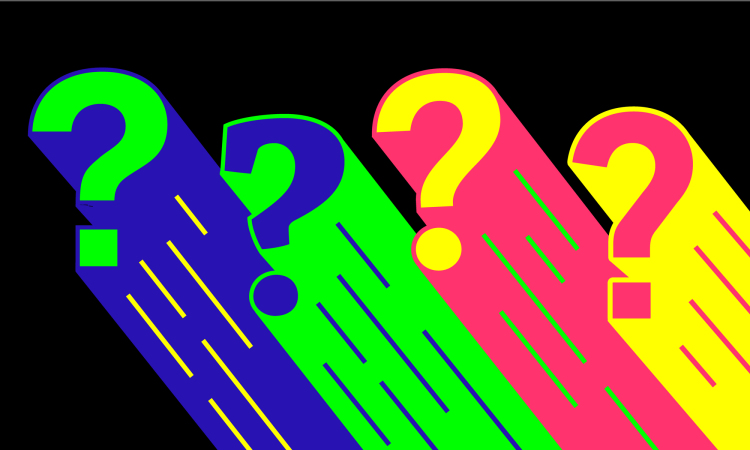

In Vue, sometimes there is a need to pass data between two components that are part of separate trees in the component hierarchy, for example there may be two tables on a page, and when one a user edits data in one table, data in the other must update. The table rows are part of two separate component trees. This may be what the component tree looks like:

