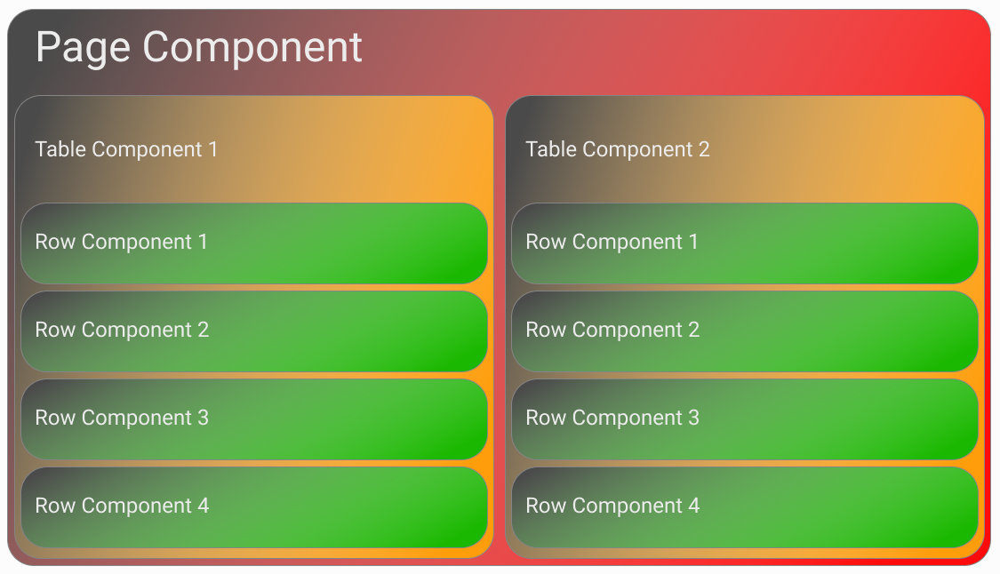

In Vue, sometimes there is a need to pass data between two components that are part of separate trees in the component hierarchy, for example there may be two tables on a page, and when one a user edits data in one table, data in the other must update. The table rows are part of two separate component trees. This may be what the component tree looks like:

  

How would the row component on the left communicate with a row component on the right? Normally we would pass an event from the row, up to the table, and then to the page and then back down into the table and then finally the row component on the right, but it need not be this complicated. That's where event busses come in. They provide a conduit for passing events from one component directly to another.